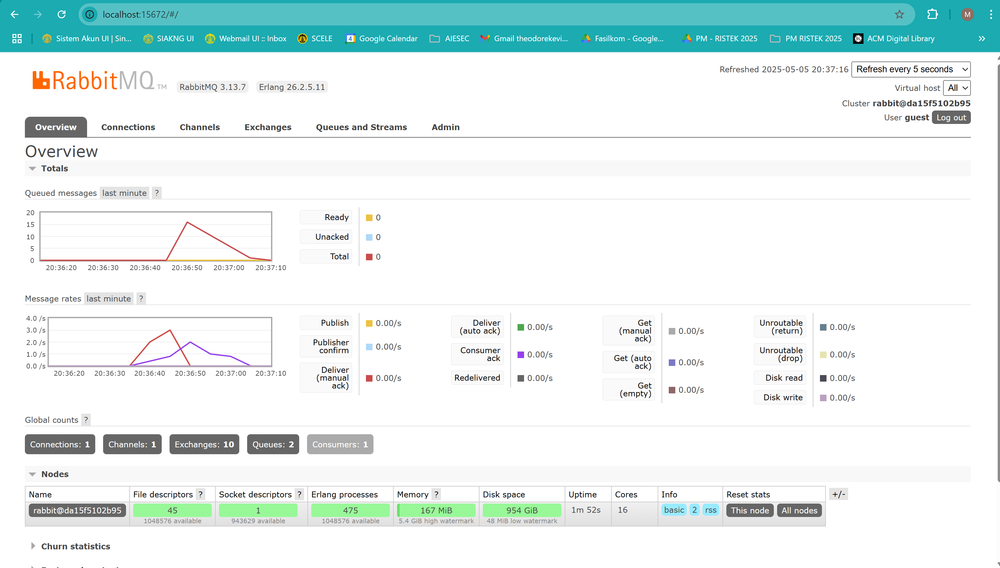
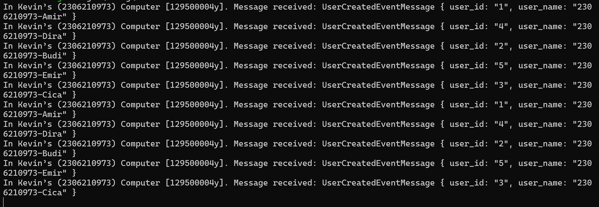
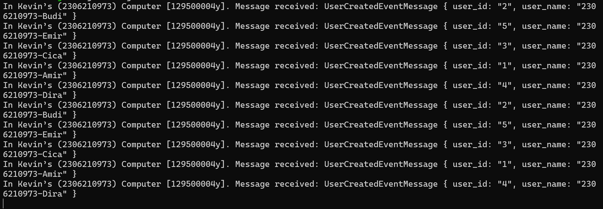
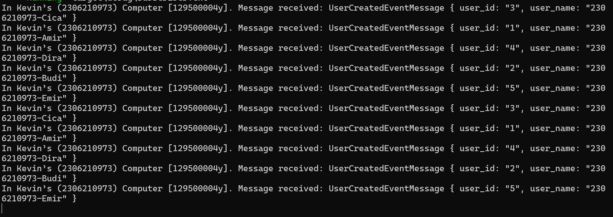

# Tutorial A: Subscriber

**Name**: Theodore Kevin Himawan

**NPM**: 2306210973

**Class**: Adpro A

## Reflection 1

> a. What is amqp?

AMQP or Advanced Message Queuing Protocol is a protocol used for message-oriented middleware. It allows an application to communicate with the message broker that implements the protocol.

> b. What does it mean? guest:guest@localhost:5672, what is the first guest, and what is the second guest, and what is localhost:5672 is for?

That is an AMQP URI that is used to connect to a RabbitMQ server. The first guest is the username, while the second guest is the password. Localhost:5672 is the hostname where RabbitMQ is running (in this case is my local computer, in port 5672).

## Simulating Slow Subscriber

The total number of queue is because of the number of data sent by the publisher. Because the code is simulated to be slow, there are more requests to be processed by the slower subscriber than the publisher. All the unprocessed requests are put in the queue. In my computer, I got 15 queues.

## Running at least 3 Subscribers

**Console 1**

**Console 2**

**Console 3**

**RabbitMQ**

I ran three subscribers at the same time, which made RabbitMQ able to distribute messages more effectively. This is evident in the message rate chart, where there's a small spike in message delivery, followed by a rapid decrease in queue size. Because the subscribers process messages at nearly the same time, messages don't stay in the queue for long. This shows that increasing the number of consumers helps manage message requests more efficiently, reducing latency and maintaining responsiveness under load. In my opinion, for improvements, the subscriber currently uses an infinite loop without any condition, which leads to unnecessary CPU usage. It would be better to implement a signal handler or communication channel for a graceful shutdown. Additionally, both programs lack proper error handling for publish_event calls and do not perform cleanup when the program exits. The subscriber also sets queue properties explicitly, but they are not optimized.

